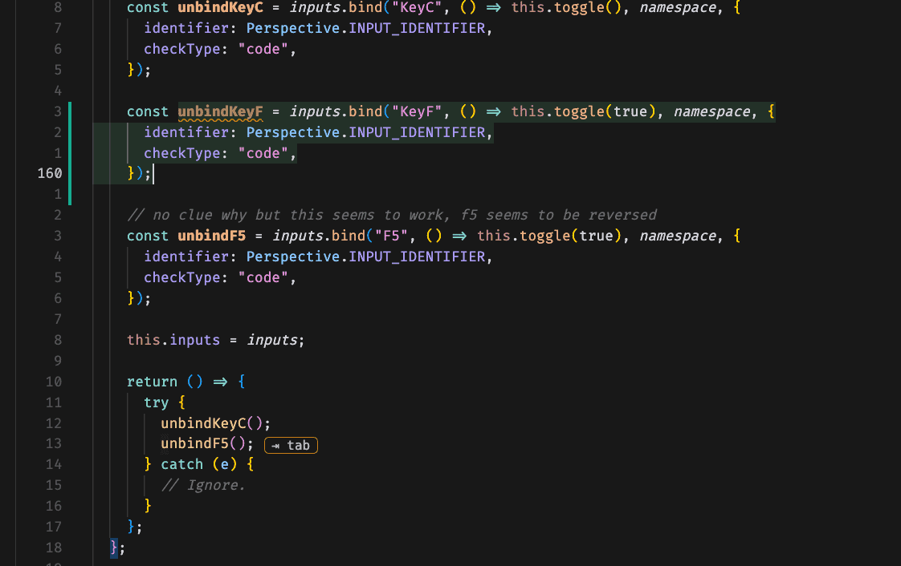
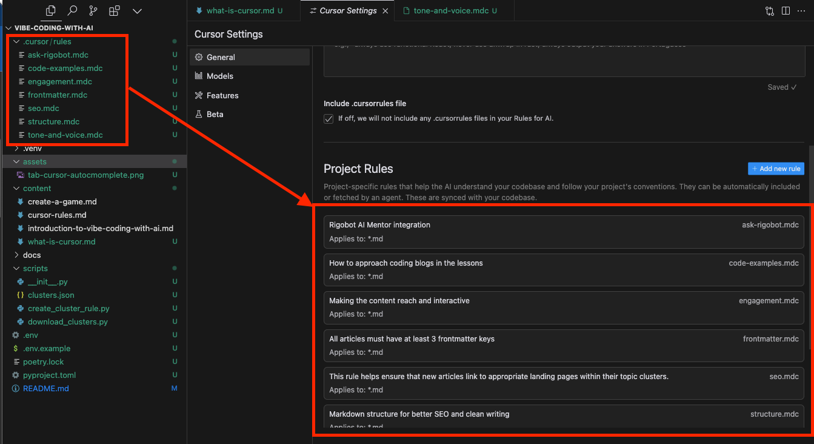

Cursor is an AI-powered code editor that helps you write, edit, and debug code faster and more efficiently than -almost- any other tool out there. Built on top of VSCode (which we'll discuss more later), Cursor combines the familiar interface of a modern code editor (like VSCode) with powerful AI capabilities that understand your code and help automate repetitive tasks. 

In this lesson we will go over the key features you need to master about Cursor and set you up for the most successful [vibe coding with AI](https://4geeks.com/bootcamp/vibe-coding-with-ai).

## Why Cursor Stands Out

- **Fork of VSCode**: Being a fork of the most popular code editor in the world, Cursor is built on top of the same technology that powers VSCode. This means hundreds of plugins and extensions are compatible with Cursor. Enterprises and companies use VSCode and now Cursor to code.
- **Cursor Agent Mode**: Cursor's Agent Mode is a feature that allows the AI agent to basically take control of your code editor and do things like create files, update previous files, execute terminal commands, and more. This was not possible with other editors but now its being replicated everywhere.
- **Cursor Rules**: Another featured invented by Cursor is the ability to create rules for the AI agent to follow. This allows you to customize the AI to your needs. This makes coding with AI 10x more efficient and enjoyable. I could not imagine coding without cursor rules.
- **Rate of improvement**: These people don't sleep. They release feature after feature and the competitors can't keep up, using other cools like the famouse Githhub Copilot feels like being 6 months behind.

## Key Features for an Efficient Workflowx

### 1. Intelligent Auto-Completion

Cursor’s autocomplete system is 10x better than any other editor out there (belive me, I've tried them all). As you type, it predicts what you’re aiming for and offers suggestions to speed up your coding. But these suggestions are not just on your current line of code, it will also predict what you're going to type next based on the context of the code you've written and show a little "tab" icon to let you know that it will autocomplete the rest of the code for you.

*With Cursor, typing out that `console.log(greet("World"));` might take just a few keystrokes as it predicts and fills in for you.*

### 2. Cursor Rules

Cursor Rules are this awsome feature that allows you to create files that tell the AI what to do in every possible scenario.

You can create as many rules as you want, all you do is create a folder .cursor/rules and create a file for each rule, these files need to end with the .mdc extension, and you walso have to set the file extensions in which the rule will apply.

## Practical Tips for Beginners

- **Customize Your Setup**: Tweak theme, font size, and keybindings to match your preference. A cozy environment keeps you in the coding flow.
- **Use Extensions**: Browse and install extensions for your language of choice—extra tools for linting, formatting, or testing are never a bad thing.
- **Take Advantage of Shortcuts**: Cursor supports a variety of keyboard shortcuts that streamline tasks. Hitting fewer keys means saving more time!

## Wrapping Up

Cursor is far more than just another code editor—it’s a productivity powerhouse. From real-time collaboration to powerful debugging features right out of the box, it’s built to simplify your coding journey. If you’re ready to take your development game to the next level, give Cursor a spin.

Remember: the key to mastering any tool, including Cursor, is consistent practice. Don’t be afraid to experiment—try out the debugging tool on a small project or team up with a friend to explore real-time collaboration. You’ve got this!

Feeling pumped? Fire up Cursor and dive right in. Happy coding!